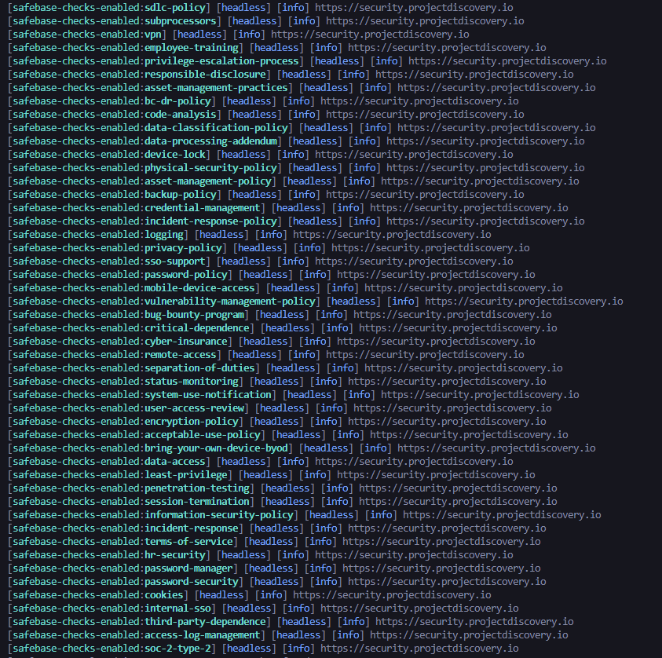

# Internal Security Detection (via Safebase)

Exposed SafeBase portals serve two audiences at once: prospects who need proof of your security posture, and security researchers (blue and red teamers). Each green tick reveals a control that (supposedly) exists today; every missing tick is an equally loud hint at what doesn’t.

# Why collect this data?
Compliance frameworks like ISO 27001, SOC 2, PCI-DSS, and the growing privacy regulations in different regions require "evidence" that security controls are in place and functioning. Safebase offers a convenient way to provide this without endless email exchanges for proof or documents.

Scraping your own public trust center might seem unnecessary since you created it, but there are other good reasons to do so:

1. Continuous assurance – Auditors increasingly prefer ongoing evidence.
2. Policy titles, groupings, and even control names can change after a platform update or acquisition. Automated scraping can detect these changes before customers notice.
3. Third-party mappings – Converting the list into JSON allows you to cross-reference against control libraries (e.g., NIST 800-53) and automatically prove coverage.
4. For blue teams, this ensures that public claims remain accurate; for red teams, it provides a quick comparison with your own control library to identify "weaknesses."

# How do I run this script?

1. Download Nuclei from [here](https://github.com/projectdiscovery/nuclei)
2. Copy the template to your local system
3. Run the following command: `nuclei -u https://yourHost.com -headless -t template.yaml` 

The output should look like:

*An in-depth guide can be found here: [Internal Security Detection](https://blog.rxerium.com/internal-security-detection)*

# References

- https://safebase.io

# Contact

Feel free to reach out to me on [Signal](https://signal.me/#eu/0Qd68U1ivXNdWCF4hf70UYFo7tB0w-GQqFpYcyV6-yr4exn2SclB6bFeP7wTAxQw).